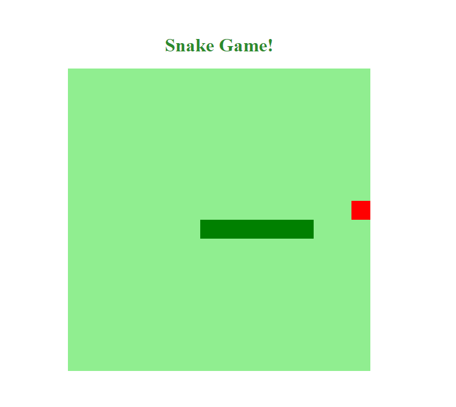

# HTML-Web-Developer 🚀
Bootcamp organizado pela [Digital Innovation One](https://web.digitalinnovation.one/track/html-web-developer). 
Aprenda a programar páginas de internet e desenvolver websites utilizando HTML, CSS e JavaScript para iniciar sua trajetória profissional em desenvolvimento web front-end.

Conteúdo do Bootcamp: 

***

<h2>Bem-vindo à DIO</h2>

Seja bem-vindo à Digital Innovation One, o maior ecossistema open education em desenvolvimento de software da América Latina. 
Você vai começar agora uma jornada para criar o seu currículo com portfólio de projetos inovadores e acelerar a sua carreira para conquistar grandes oportunidades.

<a href="https://certificates.digitalinnovation.one/66C11C14">Certificado</a>

-----------------------------------------------------------------------

<h2>Lógica de programação essencial</h2>

Lógica de programação é a forma como o desenvolvedor entende a comunicação a fim de programar uma função de um programa. Faz uso de algoritmos, que são sequências de passos bem estabelecidos, como por exemplo, uma receita de bolo.

<a href="https://certificates.digitalinnovation.one/3A539101">Certificado</a>

-----------------------------------------------------------------------

<h2>Introdução ao Git e Controle de Versões</h2>

Aprenda o que é controle de versão e como trabalhar com o Git, assim como os seus principais comandos.

<a href="https://certificates.digitalinnovation.one/86BB6161">Certificado</a>

-----------------------------------------------------------------------

<h2>Introdução a criação de websites com HTML5 e CSS3</h2>

Nesse curso o especialista vai contar um pouco sobre a história do HTML5 e do CSS3, explicar como funciona a estrutura básica dessas tecnologias, sua semântica, principais elementos e comandos.

<a href="https://certificates.digitalinnovation.one/3730F957">Certificado</a> 

-----------------------------------------------------------------------

<h2>Recriando a página inicial do Instagram</h2>

Página de login do Instagram: nesse projeto, será abordado o conceito sobre CSS Flexbox e responsividade, preparando os alunos para as aulas de jogos, nas quais será utilizado o CSS junto ao JavaScript para estilização e posicionamento.
Projetos/ResultadoFinalInstagram.PNG

<a href="https://certificates.digitalinnovation.one/9EB9AF9E">Certificado</a> 
 

-----------------------------------------------------------------------

<h2>Programação para internet com JavaScript</h2>

JavaScript é uma das mais importantes linguagens front-end, e nesse curso você entenderá o porquê disso e como trabalhar com ela.

<a href="https://certificates.digitalinnovation.one/A73F093F">Certificado</a> 

-----------------------------------------------------------------------

<h2>Introdução a Programação com JavaScript</h2>

Nesse desafio de codificação você irá praticar através do desenvolvimento de algoritmos os conceitos de pensamento computacional apresentados nas aulas e exercícios anteriores.

*Não possui certificado*

-----------------------------------------------------------------------

<h2>Recriando a Interface do Netflix</h2>

Recrie a interface do principal site de streaming mundial utilizando tecnologias simples como HTML5, CSS3 e JavaScript. Nesse projeto você aprenderá: como estruturar um layout, técnicas de CSS3 com containers e variáveis, como posicionar os elementos com Flexbox e como utilizar plugins Jquery a favor da sua aplicação.

<a href="https://certificates.digitalinnovation.one/3BDD6F2B">Certificado</a> 
 

-----------------------------------------------------------------------

<h2>Construindo páginas para internet com Bootstrap</h2>

Aprenda a utilizar o framework Bootstrap e aprofunde mais o seu conhecimento em HTML5 e CSS3.

<a href="https://certificates.digitalinnovation.one/237D8C8F">Certificado</a> 

-----------------------------------------------------------------------

<h2>Fundamentos Aritméticos em JavaScript</h2>

Nesse desafio de codificação você irá praticar através do desenvolvimento de algoritmos os conceitos de pensamento computacional apresentados nas aulas e exercícios anteriores.

*Não possui certificado*

-----------------------------------------------------------------------

<h2>Recriando o jogo da cobrinha com JavaScript</h2>

Já pensou em criar seu próprio jogo do zero? Aprenda a desenvolver de forma simples o clássico jogo da cobrinha utilizando HTML, CSS e JavaScript.

<a href="https://certificates.digitalinnovation.one/8787EBEC">Certificado</a>
 

-----------------------------------------------------------------------

🚀 May the code be with you! 🚀
